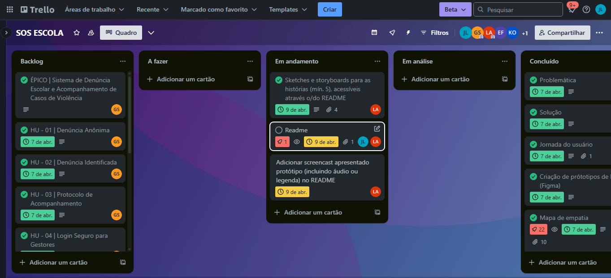
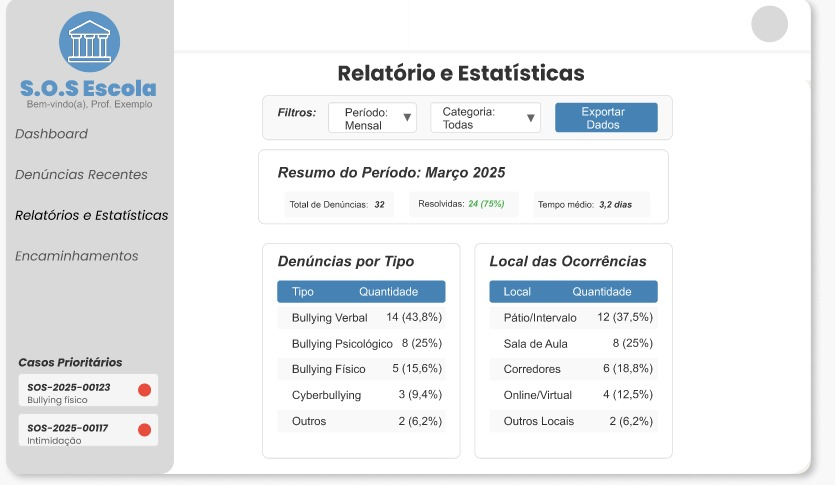
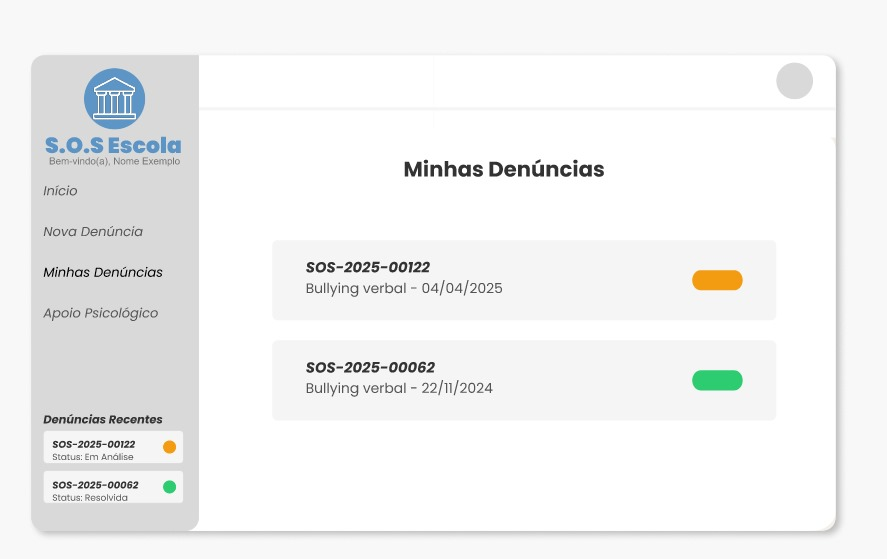
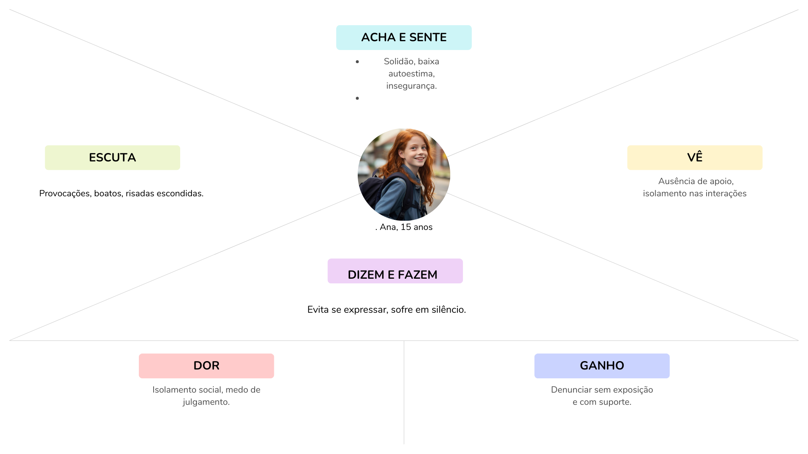

# Documentação do projeto

### 📢 S.O.S escola - Sistema de Denúncias Escolares com IA

Através de um projeto inovador com foco em segurança e bem-estar estudantil, estamos desenvolvendo a **S.O.S Escolar**, uma plataforma web voltada ao combate ao bullying e à violência escolar.  

A solução permite **denúncias anônimas ou identificadas**, conta com **IA para triagem de urgência** e oferece **suporte emocional automático e humano**.  

Além disso, disponibiliza um **dashboard com métricas** para gestores escolares, promovendo ações rápidas e baseadas em dados.  

Alinhado aos **Objetivos de Desenvolvimento Sustentável (ODS)**, o projeto visa construir ambientes escolares mais saudáveis, inclusivos e acolhedores.  

Desenvolvido com **React**, **Spring Boot**, **Python** e **PostgreSQL com criptografia**.

---

## 🚀 Tecnologias Utilizadas

  
  
  
  
  
  
  
  
  
  
  

---

## 📌 Etapas do Projeto

Elaboramos um quadro no Trello, acessível mais abaixo nesta documentação, onde estruturamos **10 histórias de usuário** para nossa aplicação web.  

Com base nessas histórias, desenvolvemos **protótipos por meio de esboços e storyboards**, que foram apresentados em formato de **screencasts**.

---

## 👥 Equipe de Desenvolvimento

| Integrante | Perfil |
|------------|--------|
|  | **Jose Leandro De Morais Alvez Luz** [@jleandromorais](https://github.com/jleandromorais) |
|  | **Gabriel Souza Santos** [@06gabrielsouza](https://github.com/06gabrielsouza) |
|  | **Kayky Dias Oliveira** [@kaykyDias04](https://github.com/kaykyDias04) |
|  | **Levi Moraes Moura Andrade** [@LeviMoraesMoura](https://github.com/LeviMoraesMoura) |
|  | **Enzo Antuna Ferreira** [@Enzo-Antuna](https://github.com/Enzo-Antuna) |

## 📌 Status do Projeto

Acompanhe o andamento pelo nosso quadro no Trello:

🔗 [Ver Trello](https://trello.com/b/rqZ4UClp/sos-escola)

### 🖼️ Quadro Atual:

## 📖 Histórias de Usuário (HUs)

---

### 🛡️ Bloco 1: Denúncia + Apoio + Privacidade (HUs 01, 07 e 10)

| Código | Funcionalidade                   | Critérios de Aceitação |
|--------|----------------------------------|-------------------------|
| HU-01  | Denúncia anônima                | ✔️ Formulário sem campos obrigatórios de identificação ✔️ IP e metadados não armazenados ✔️ Confirmação visual de envio bem-sucedido |
| HU-07  | Canal com psicólogos            | ✔️ Chat integrado com profissionais ✔️ Opção de agendamento de sessão ✔️ Recursos de autoajuda (PDFs, vídeos) |
| HU-10  | Controle de compartilhamento de dados | ✔️ Checkbox para autorização de uso dos dados ✔️ Explicação clara sobre como os dados serão usados ✔️ Opção de revogar consentimento posteriormente |

> 🔐 **Estas HUs estão integradas para garantir segurança, suporte e privacidade desde o primeiro acesso.**

---

### 📊 HU-08: Histórico de Denúncias (Gestor)

| Código | Funcionalidade        | Critérios de Aceitação |
|--------|------------------------|-------------------------|
| HU-08  | Acesso ao histórico    | ✔️ Filtros por data, tipo de violência e status ✔️ Visualização de padrões (heatmap de ocorrências) ✔️ Exportação em CSV/PDF para relatórios |

🔹 **Objetivo:** Permitir ações preventivas baseadas em dados.

---

### 📨 HU-03: Protocolo de Acompanhamento

| Código | Funcionalidade           | Critérios de Aceitação |
|--------|--------------------------|-------------------------|
| HU-03  | Geração de protocolo     | ✔️ Número único com QR code para consulta ✔️ Atualizações em tempo real (ex.: "Em análise") ✔️ Notificação por e-mail/SMS quando houver mudanças |
## 📖 Histórias de Usuário (HUs)

--- 
## 👥 Personas

### 1. Aluno Vítima (Ana, 14 anos)

- **Medo:** Retaliação ao denunciar  
- **Necessidade:** Canal confidencial e rápido

📁 **[Download Personas.zip](caminho/para/Personas.zip)** _(Inclui perfis completos em PDF/PPT)_

🖼️ **Persona Aluno** (Imagem do Figma)

---

## 🗺️ Mapa de Empatia

| O que sente?                        | O que precisa?                          |
|------------------------------------|-----------------------------------------|
| Ansiedade, medo de não ser levado a sério | Garantia de ação rápida e sigilo         |

📁 **[Download Mapa_de_Empatia.zip](caminho/para/Mapa_de_Empatia.zip)** _(Inclui entrevistas e pesquisas)_
🖼️ **Mapa de empatia**

---

## 🎨 Protótipos (Figma)

### Telas Principais:

- **Login Seguro** (Gestores/Alunos)
- **Formulário de Denúncia** (com opção de anonimato)
- **Dashboard de Gestão** (métricas e priorização)

🔗 **[Acesse o Protótipo Completo](link/do/prototipo/aqui)**  
📁 **[Download Assets_Figma.zip](caminho/para/Assets_Figma.zip)**

## 🎥 Demonstração do Protótipo
